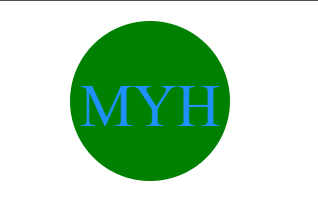

# OOP-sie-daisy

  ## Description

  This OOP-sie-daisy was created for boot camp students who were going through Module 10. It contains a logo generator that takes in inputs for the text, text-color, shape-color, and shape, and prints it out onto a logo.svg page.

  ## Table of Contents

  * [Installation](#installation)
  * [Usage](#usage)
  * [License](#license)
  * [Screenshots](#screenshots)
  * [Contributing](#contributing)
  * [Tests](#tests)

  ## Installation

  Node Inquirer 8.2.4, nodejs, and node jest

  ## Usage

  The app is used through commands in the terminal. Enter node index.js into the terminal, and enter your input to the following questions. It will then print your responses to a logo.svg document, and pop a logo when opened through default browser.

  ## License

  

  [License](#license)

  This project is license under the MIT license.

  ## Screenshots

  [screencastify](https://drive.google.com/file/d/1n6rtyIxn7xxfOwga70NyGUjE8i1dXTan/view)

  

  ## Contributing

  Special thanks to Emma, Big Mike, Patricia, Bryan, and Shawn for guiding me through this experience!

  ## Tests

  node index.js
  
  npm run test